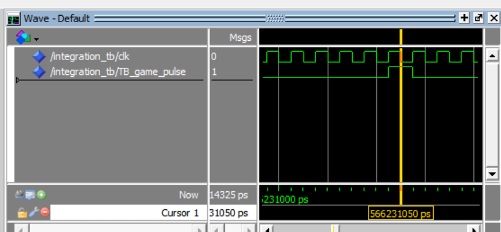
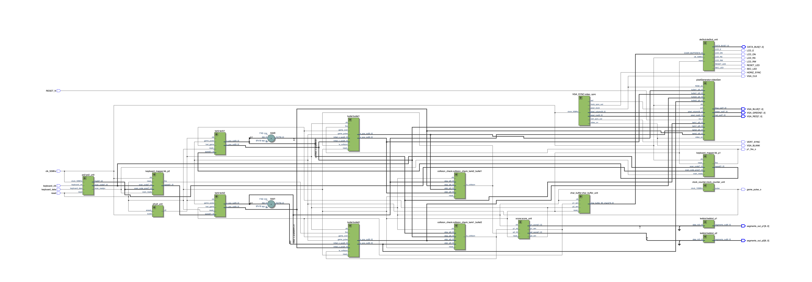
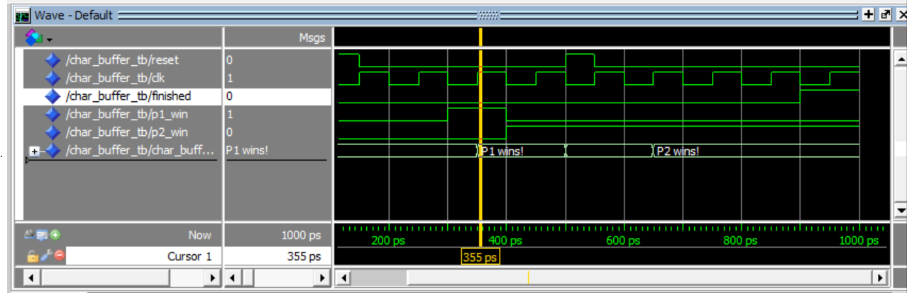
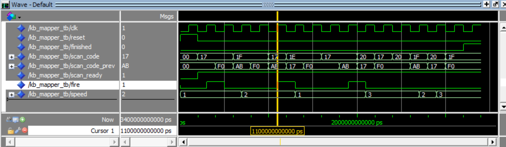
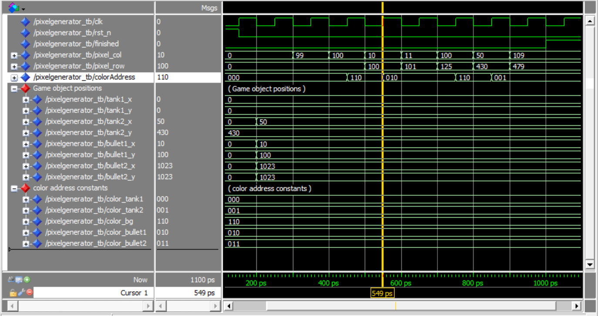
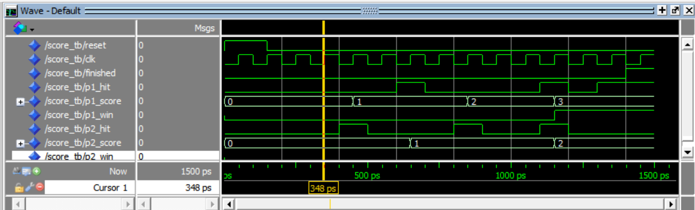
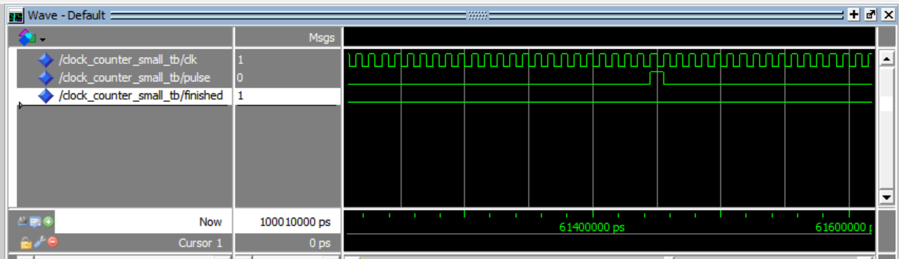

# CE355 Final Project – FPGA Tank Game

**[Jackson Bremen](https://github.com/readjfb) and [Talia Ben-Naim](https://github.com/taliabn)** -
**Northwestern University CE 355, Fall 2023**

**Contents**
- [CE355 Final Project – FPGA Tank Game](#ce355-final-project--fpga-tank-game)
	- [Introduction](#introduction)
	- [Design Process and Methodology](#design-process-and-methodology)
	- [System Architecture](#system-architecture)
		- [VGA Output](#vga-output)
		- [PS/2 Keyboard Input](#ps2-keyboard-input)
		- [7-Segment LED Display](#7-segment-led-display)
		- [LCD display](#lcd-display)
		- [Clock Counter](#clock-counter)
		- [Tank](#tank)
		- [Bullet](#bullet)
		- [Collision Detection](#collision-detection)
		- [Scoring](#scoring)
	- [Board Implementation and Peripherals](#board-implementation-and-peripherals)
		- [RTL Design](#rtl-design)
		- [Peripeherals](#peripeherals)
			- [Inputs](#inputs)
			- [Outputs](#outputs)
		- [PLL and Clocking](#pll-and-clocking)
	- [Simulation Figures and Testing Methodology](#simulation-figures-and-testing-methodology)
					- [char\_buffer simulation](#char_buffer-simulation)
					- [kb\_mapper simulation subset](#kb_mapper-simulation-subset)
					- [pixelGenerator simulation subset](#pixelgenerator-simulation-subset)
					- [score simulation subset](#score-simulation-subset)
					- [Zoomed in view of clock counter simulation](#zoomed-in-view-of-clock-counter-simulation)
	- [Synthesis Results](#synthesis-results)
		- [Used memory:](#used-memory)
		- [Clocks:](#clocks)
		- [FMax:](#fmax)
					- [Slow 1200mV 85C Model Fmax Summary](#slow-1200mv-85c-model-fmax-summary)
		- [Resource utilization:](#resource-utilization)
					- [Fitter Resource Usage Summary](#fitter-resource-usage-summary)

## Introduction
For this project we implemented a basic tank game on the DE2-115 FPGA development board. The game is played by two players, each controlling a tank on opposite sides of the screen. The goal of the game is to shoot the other player’s tank before they shoot yours. The game is played on an external 640x480 VGA display, and the tanks are controlled by an external PS/2 keyboard. Scores are displayed on the on-board 7-segement LED displays, and the winner of the game is displayed on an on-board LCD display. The game is written in VHDL 1993.

## Design Process and Methodology
The game was designed in a modular fashion, with each component of the game being implemented as a separate module. The modules were then integrated together to form the final game in a single top-level module. The modules were tested individually using testbenches, then tested together in simulation, and then the game was tested as a whole on the FPGA.

We wanted to create a fully structural top-level module for our design, so each of these modules needed to operate independently of each other, having inputs and outputs that could be directly connected to each other. Before beginning the project, we fully scaffolded out what each  module would need to perform, the widths of each `std_logic` or `std_logic_vector` signal, and the inputs and outputs of each module. This allowed us to plan for a fully structural top-level module that would integrate each module together.

Additionally, this design strategy allowed us to divide up the work, and work/test each module independently (see [Simulation Figures and Testing Methodology](#simulation-figures-and-testing-methodology) for more details on our testing strategy).

Infrastructure modules were created first and leveraged the provided miniproject code where applicable. These modules included

 - VGA Controller
 - PS/2 Keyboard Controller
 - 7-segment LED Decoder
 - LCD Screen Controller
 - Clock Counter

We then scaffolded and mapped out the other modules needed. In addition to our top-level module, we needed to create modules for the following:

 - Tank
 - Bullet
 - Scoring
 - Collision Detection

Connecting game logic to the peripherals also required creating the following modules:

 - Keyboard Event Interpreter
 - VGA Pixel Generator
 - LCD Text Generator 

## System Architecture

### VGA Output
We created a custom module to generate pixel colors, located in our [pixelGenerator.vhd](game/pixelGenerator.vhd) file. If a pixel is with in bounds of a game object, it will be the constant color of that game object, otherwise it will be the constant color of the background. The `pixelGenerator` module takes in a pixel's location and all game object locations, and it outputs the 10-bit red, green, and blue color values for that pixel.

### PS/2 Keyboard Input
To take in keyboard input, we used the PS2 module, located in our [ps2.vhd](game/ps2.vhd) file and the keyboard module located in our [keyboard.vhd](game/keyboard.vhd) file. The `keyboard` module takes inputs from the `PS2` module and outputs the key that was pressed. The `keyboard` module also debounces the input. There is another module located in the [kb_mapper.vhd](game/kb_mapper.vhd) file that takes in the key presed and the previous key pressed, and it generates signals for speed and bullet firing. To make the design more modular and to avoid repeating logic in the module, the top-level module has two instances of the `keyboard_mapper` module, one for each player. Scan codes indicating which keys the player uses to play are passed in as generics.

### 7-Segment LED Display
The players' scores are displayed on the 7-segment LED display. The 7-segment LED display is directly controlled by the `leddcd` decoder module, located in the [leddcd.vhd](game/leddcd.vhd) file. The `leddcd` module takes a zero-extended score from from the `score` module as its only input.

### LCD display
When a player wins the game, a message declaring the winner displayed on the 7-segment LED display. The LCD display is controlled by the [de2lcd.vhd](game/de2lcd.vhd) file. It is fed ASCII characters from a `char_buffer` module (located in [char_buffer.vhd](game/char_buffer.vhd)) that uses signals from the `score` module to know if either player has won the game.

### Clock Counter
Since the game clock is 100 MHz, we needed a way to produce a pulse considerably slower to allow for the game to be playable. We targeted a 45 fps game. To do this, we created a `clock_counter` module, located in our [clock_counter.vhd](game/clock_counter.vhd) file. This module takes in the 100 MHz clock and has a 21 bit counter inside. When the counter equals zero (values are unsigned so when the value of $2^{21}-1=2097151$ is passed, the counter resets to zero), the module outputs a pulse. This game_pulse signal is used to advance the game logic. This results in an FPS of roughly $\frac{100 *10^{6} Hz}{2^{21}}=47.68$ pulses per second. Each pulse is one clock tick long, as seen in the following simulation waveforms.

### Tank
The tank module is located in our [tank.vhd](game/tank.vhd) file. `tank` takes in a speed from 1-3 from `keyboard_mapper` (speed can be set to 0 for testing purposes). It moves horitzontally in one direction until it reaches a side, in which case it bounces off and moves in the opposite direction. `tank` stores its own position, and outputs this position to the top-level module. `tank` also takes in a signal to let it know if it has lost the game, and should move off the screen.
`tank` is structured as an FSM, with states being advanced only on a game_pulse. However, data is appropriately clocked to the main game clock.

### Bullet
The bullet module is located in our [bullet.vhd](game/bullet.vhd) file. When it recieves the fire signal, it moves to its tank's position, and begins to move vertically. If it hits the opposite side, it moves off the screen. It has an input from `collision_check` to let it know if it has hit the other tank, and should move off the screen. The bullet stores its own position, and outputs this position to the `top_level` module.
Bullet is structured as an FSM, with states being advanced only on a game tick pulse. However, data is appropriately clocked to the main game clock.

### Collision Detection
The collision detection module is located in our [collision_check.vhd](game/collision_check.vhd) file. Two instances of this module are used in `top_level`, one to detect bullet1 --> tank2, and bullet2 --> tank1. The module takes in the positions of the two objects, and outputs a signal if they are colliding. It takes the sizes of each object as a generic. The module uses a simple bounding box collision detection algorithm. This algorithm was intentionally kept simple, and has a very short datapath when viewed in RTL.

### Scoring
The `score` module is located in our [score.vhd](game/scoring.vhd) file. It takes in signals from the `collision_check` module that indicate if a player's tank was hit. If a tank was hit, the opposite player scores a point. For extensibility, the number of points needed to win comes from the generic `win_score`. In addition to outputting each player's score, the module outputs a signal indicating if each player has won.
The scoring module is structured as an FSM with three states: scored, gameplay, and win. To debounce collisions and avoid accidental double scoring due to potential mistiming with the bullet moving offscreen, the scoring module is held in the scored state until both collision signals are deasserted. This ensures that the score is only incremented once per collision, which happens in the gameplay state.

## Board Implementation and Peripherals
### RTL Design
**RTL Schematic**
<!-- Add photo images/rtl-diagram.png -->

The game was compiled, elaborated, and programmed onto the DE2-115 board using the Quartus Prime 22.1 software and uploaded via a USB-Blaster. As can be seen from the above screenshot, the final RTL schematic of the top-level module is primarily structural, with each module being connected to each other. The top-level module is located in our [top_level.vhd](game/top_level.vhd) file.

### Peripeherals

#### Inputs 

To read from the PS/2 keyboard peripheral, we first wait for a scan code to be ready, which indicates that the data from a keybord event is available to be read. We look at the current and most recent scan code. If the scan code represents a key used in the game, we check to see if the previous code was the break code for that key; if it was, we know that the key was released, otherwise we know that the key was pressed. We use these keyboard inputs as control signals for an FSM in `keyboard_mapper` to select and hold a speed that is then fed to the tank module. In addition, the FSM generates a one-cycle pulse when the fire key is pressed, which is also an input to the `tank` module. 

The only other input is the hardware push button KEY[0] on the dev board, which is used to reset the game. When this button is pressed, the game resets and the scores are set to 0. Reset is also wired to the LED LEDG[5], giving the players a visual cue that the game is in reset mode.

#### Outputs

To write to the VGA display, we first use the `pixelGenerator` module to generate the color of individual pixels. Since the DE2-115 FPGA board does not have enough ROM to fit the 30-bit RGB color value of all 307200 pixels in the 640x480 VGA display, we used conditional logic based on game object positions to determine the color for each pixel. A small 30x8 ROM is used to store a color map, allowing us to easily use different colors for the tanks, bullets, and background. We then use the `vga_synch` and `vga_top_level` modules from the provided miniproject code to control writing pixel data to the screen one row at a time and sending (pixel_row, pixel_column) coordinates to [pixelGenerator.vhd](game/pixelGenerator.vhd).

To write scores to the 7-segment LED display, segments are directly wired the output from the `leddcd` decoder module, which maps an input number to a std_logic_vector indicating which segments should be lit. 

To write to the LCD display, the `de2lcd` module writes one character at a time to a data bus, which is wired to the display on the board. These characters come from the `char_buffer` module. If neither player has won, the LCD display will be blank.

### PLL and Clocking
The base DE2-115 board has a 50 MHz clock, but for the purposes of the assignment we decided to use a 100 MHz clock. This allowed us to have a higher resolution game. To step between these speeds, we created a PLL module using the Quartus software that takes in the 50 MHz system clock and outputs a 100 MHz clock. This PLL module is located in our [pll.vhd](game/pll.vhd) file.

## Simulation Figures and Testing Methodology
As mentioned above, we created simple tests, fully testing one or two modules at a time in simulation before integrating them into larger tests.  We chose to structure most of our tests using `assert` statements, as this allowed us to easily see if the test passed or failed. We also used `report` statements to print out the values of signals, and `wait` statements to pause the simulation. Each testbench operates independently, and has hard-coded inputs and outputs. This method gave us more control over when to change inputs and check outputs as compared to a file-based testbench that reads input and expected output values in a strictly regularly structured loop.

To run our plethora of testbenches, we used GHDL and ModelSim. All testbenches can be run in GHDL at the same time with the bash script [run.sh](game/run.sh) to rapidly find issues. We found GHDL to be a very useful tool when running testbenches from the command line, as its simulation and compile times were orders of magnitude faster than ModelSim - compiling and running testbenches took 0-5 seconds compared to minutes in ModelSim. Furthermore, GHDL is open source and runs on all operating systems, wheras ModelSim is Intel's IP and cannot run on Apple machines. 
After initially testing with GHDL, we used ModelSim to view the waveforms of our testbenches to ensure that they were working as expected, comparing with the transcript to be doubly sure. Screenshots of waveforms may be found below.

We were able to confidently test all modules except for the `clock_counter` module, which were were unable to exhaustively test in simulation due to the very high number of clock cycles (100M+) required to test its full functionality. We were able to test the clock counter module in simulation by using a smaller counter, and then testing the full functionality on the FPGA.

**bullet_tank_tb.vhd**
 * Tests the bullet and tank modules together
 * Single tank moving back and forward
   * Dynamic/changing speed
 * Fires bullet
 * Bullet moves, moves offscreen when applicable
 * Bullet can be refired when needed

**char_buffer_tb.vhd**
  * Tests the char_buffer module
  * Tests to make sure that the correct buffer is outputted for given win signal inputs
  * Tests that the buffer is cleared to all spaces on reset or in the absence of a win 

###### char_buffer simulation

**collision_check_tb.vhd**
  * Tests the `collision_check` module
  * Tests to make sure that the correct output is given for a given input
  * Single module test; Simply uses numeric values, does not integrate tank
  * Tests multiple combinations of inputs, including two objects of different shapes, levels of overlapping (edges overlapped vs touching), and different positions

**fire_collision_tb.vhd**
 * Uses 2 tanks and 2 bullets, 1 collision detection module
 * Static tank positions (uses testing speed of 0)
 * Fires bullets
 * Checks to ensure bullets move correctly
 * Check to ensure that detection of collision is correct
 * Checks to ensure that bullets move offscreen at the correct time
 * Manually cycle game pulse with constant clock for faster testing; reduce complexity

**integration_tb.vhd**
 * Tests the full integration of `tank`, `bullet`, `collision_check`, `score`, `char_buffer`, and `clock_counter`
 * Simulation takes a longer time to run, but tests the full functionality of the game minus the VGA output, 7-segment LED display, and moving tanks
 * Tests to make sure that the correct output is given for a given sequence of inputs
 * Tests both players scoring, shooting
 * Tests one player winning

**kb_mapper_tb.vhd**
 * Tests the `keyboard_mapper` module in simulation
 * Tests that speed is correctly initialized to the slowest speed on reset
 * Tests that correct speed is outputted for a given key press and is held appropriately
 * Tests that fire is only asserted for one cycle after the fire key is pressed
 * Tests that speeds don't change when other keys are released

###### kb_mapper simulation subset

**pixelGenerator_tb.vhd**
  * Tests the `pixelGenerator` module in simulation
  * Tests to make sure that the correct address is fed to `colorROM` for a given (pixel_row, pixel_col) coordinate pair

###### pixelGenerator simulation subset

**score_tb.vhd**
  * Tests the `score` module in simulation
  * Tests to make sure that the scores increase after a collision and are then properly debounced and held 
  * Tests to make sure that scores don't change after a player has won

###### score simulation subset

**clock_counter_small_tb.vhd**
  * Tests a modified version of the `clock_counter` (max width is 7 bits rather than 21)
  * Shows proper behavior
    * output pulse only asserted for one clock cycle
  * Tests single module

###### Zoomed in view of clock counter simulation

## Synthesis Results
**Includes memory, clocks, and resource utilization**

### Used memory:
 - 192 / 3,981,312 ( < 1 % )
 - Total block memory implementation bits:  9,216 / 3,981,312 ( < 1 %

### Clocks:

| Clock Name                                     | Type      | Period | Frequency | Rise  | Fall   | Duty Cycle | Divide by | Multiply by | Master | Targets            | Slack Setup | Slack Hold |
|-----------------------------------------------:|-----------|--------|-----------|-------|--------|------------|-----------|-------------|--------|--------------------|-------------|------------|
| pll_unit\|altpll_component\|auto_generated\|pll1\|clk[0] | Generated | 10.000 | 100.0 MHz | 0.000 | 5.000  | 50.00      | 1         | 2           | SYSCLK | SYSCLK             | 1.598       | 0.402      |
| SYSCLK                                         | Base      | 20.000 | 50.0 MHz  | 0.000 | 10.000 |            |           |             |        | clk_50Mhz           | 4.032       | 0.405      |

### FMax:
###### Slow 1200mV 85C Model Fmax Summary
| Fmax       | Restricted Fmax | Clock Name                                           |
|------------|-----------------|------------------------------------------------------|
| 159.8 MHz  | 159.8 MHz       | pll_unit\|altpll_component\|auto_generated\|pll1\|clk[0] |
| 219.49 MHz | 219.49 MHz      | SYSCLK                                               |

The maximum frequency available is 159.8 MHz which is 59 MHz higher than the current system frequency of 100 MHz.

The longest datapaths are from keyboard mapper to tank module, and has a data delay of 5.148 with skew of -3.202

### Resource utilization:

###### Fitter Resource Usage Summary

| Resource                                    | Usage                       |
|-------------------------------------------: |:--------------------------- |
| Total logic elements                        | 742 / 114,480 ( < 1 % )     |
|     -- Combinational with no register       | 463                         |
|     -- Register only                        | 49                          |
|     -- Combinational with a register        | 230                         |
|                                             |                             |
| Logic element usage by number of LUT inputs |                             |
|     -- 4 input functions                    | 211                         |
|     -- 3 input functions                    | 207                         |
|     -- <=2 input functions                  | 275                         |
|     -- Register only                        | 49                          |
|                                             |                             |
| Logic elements by mode                      |                             |
|     -- normal mode                          | 387                         |
|     -- arithmetic mode                      | 306                         |
|                                             |                             |
| Total registers*                            | 279 / 117,053 ( < 1 % )     |
|     -- Dedicated logic registers            | 279 / 114,480 ( < 1 % )     |
|     -- I/O registers                        | 0 / 2,573 ( 0 % )           |
|                                             |                             |
| Total LABs:  partially or completely used   | 56 / 7,155 ( < 1 % )        |
| Virtual pins                                | 0                           |
| I/O pins                                    | 63 / 529 ( 12 % )           |
|     -- Clock pins                           | 1 / 7 ( 14 % )              |
|     -- Dedicated input pins                 | 0 / 9 ( 0 % )               |
|                                             |                             |
| M9Ks                                        | 1 / 432 ( < 1 % )           |
| Total block memory bits                     | 192 / 3,981,312 ( < 1 % )   |
| Total block memory implementation bits      | 9,216 / 3,981,312 ( < 1 % ) |
| Embedded Multiplier 9-bit elements          | 0 / 532 ( 0 % )             |
| PLLs                                        | 1 / 4 ( 25 % )              |
| Global signals                              | 6                           |
|     -- Global clocks                        | 6 / 20 ( 30 % )             |
| JTAGs                                       | 0 / 1 ( 0 % )               |
| CRC blocks                                  | 0 / 1 ( 0 % )               |
| ASMI blocks                                 | 0 / 1 ( 0 % )               |
| Oscillator blocks                           | 0 / 1 ( 0 % )               |
| Impedance control blocks                    | 0 / 4 ( 0 % )               |
| Average interconnect usage (total/H/V)      | 0.3% / 0.3% / 0.2%          |
| Peak interconnect usage (total/H/V)         | 5.9% / 6.2% / 5.5%          |
| Maximum fan-out                             | 101                         |
| Highest non-global fan-out                  | 100                         |
| Total fan-out                               | 2952                        |
| Average fan-out                             | 2.55                        |

* Register count does not include registers inside RAM blocks or DSP blocks.

